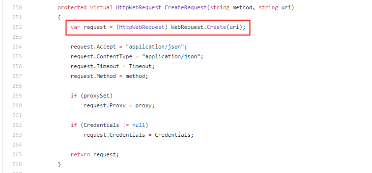
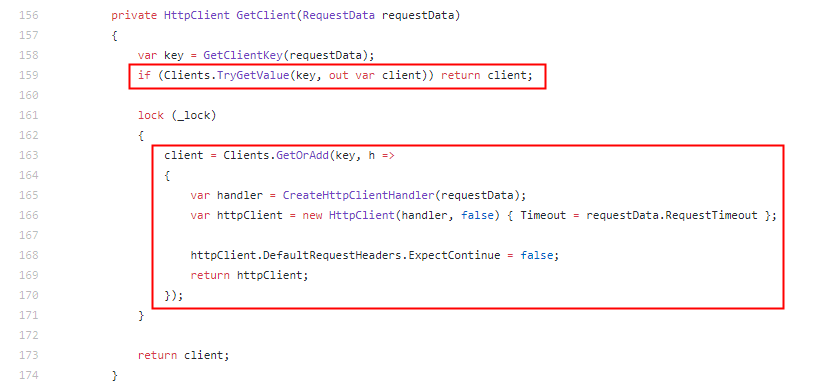

## .NetCore下ES查询驱动 PlainElastic.Net 升级 Elasticsearch.Net

#### 1.背景
笔者所在的公司原有的ES查询驱动采用的是PlainElastic.Net,经过询问原来是之前PlainElastic.Net在园子里文档较多，上手比较容易,所以作此选择而没有选择官方驱动，而发布也由于历史原因部署在windows服务器上，基于.NET Framework开发。后来经过迭代升级，迁移到 net core 平台，自然也就迁移至CentOS7.0服务器上，刚开始没有发现任何问题，迁移也比较顺利，由于没有使用特殊API，优势服务端迁移，所以几乎没有对业务代码做更多的修改。

事发突然某天运维部门反馈，部署查询服务的机器突然出现TCP连接数超高的问题，同时这台机器其他的TCP服务也无法建立新的连接，但已经建立的连接不受影响。联想到ElasticSearch查询服务是基于HTTP请求的，脑子里马上联想到 .NET Core 下 HttpClient 每次创建实例都会建立新的TCP连接的问题，立马去翻一下源代码：
https://github.com/Yegoroff/PlainElastic.Net/blob/master/src/PlainElastic.Net/Connection/ElasticConnection.cs


果然如猜测的那样，每次都创建了新的HttpWebRequest实例，看了作者的最后维护时间也已经是3年前了，可能是后来官方驱动日趋完善，作者也便停止了维护。那么这就好解决了，先看下官方最新驱动源码是否如我们想象，是基于HttpClientFactory的：


上述代码看来，并非是采用官方建议的HttpClientFactory，但是官方底层自己维护的一个线程安全的字典来管理HttpClient实例池，也就是说相同地址的请求，使用的是链接复用，这样就解决了开启多个端口的问题，驱动可以升级了！

#### 2.驱动升级
>说明： ElasticSearch.Net官方驱动地址：https://www.elastic.co/guide/en/elasticsearch/client/net-api/6.x/index.html
>
>官方驱动分为 Low Level Client 和 NEST(Heigh Level Client),其中Low Level >Client 仅仅做了最基本的封装，几乎等价于HTTP原生调用，带来了极大的灵活性，但同时对于开发人员来说使用 NEST 提供的更加友好的API，可以更加快速的进行开发工作，也同时可以利用到.NET 所提供的各种语法糖，比如 => 表达式。

话不多说，看示例代码：

###### 实例创建
``` csharp
        static ElasticClient BuildClient () 
        {
            var uris = new Uri[] { new Uri ("http://172.17.1.1:9200"), new Uri ("http://172.17.1.2:9200") }; //支持多个节点
            var connectionPool = new SniffingConnectionPool (uris);
            var settings = new ConnectionSettings (connectionPool).DefaultIndex ("testIndex");//注意默认index不可以使用大写字母
            settings.BasicAuthentication ("test", "test");//设置账号密码，如果为空可以跳过
            return new ElasticClient (settings);
        }
```

###### 插入待测试数据（由于测试需要，故意增加了常用的数据类型）
```csharp
static async Task AddPeopleAsync (People[] peoples) {
            foreach (var p in peoples) {
                var response=await _client.IndexDocumentAsync (p);
            }
        }
        static People[] BuildTestData () {
            return new People[] {
                new People { Id = Guid.NewGuid (), Name = "张三", Age = 24, Birthday = new DateTime (1984, 12, 4), Address = "上海市长宁区", Gender = true },
                new People { Id = Guid.NewGuid (), Name = "李四", Age = 24, Birthday = new DateTime (1989, 6, 23), Address = "上海市普陀区", Gender = false },
                new People { Id = Guid.NewGuid (), Name = "王五", Age = 24, Birthday = new DateTime (1993, 9, 7), Address = "上海市静安区", Gender = false },
                new People { Id = Guid.NewGuid (), Name = "赵六", Age = 24, Birthday = new DateTime (1967, 1, 28), Address = "上海市浦东新区", Gender = true },
                new People { Id = Guid.NewGuid (), Name = "阮小七", Age = 24, Birthday = new DateTime (1988, 1, 6), Address = "上海市闵行区", Gender = true },
            };
        }
```


#### 4.总结