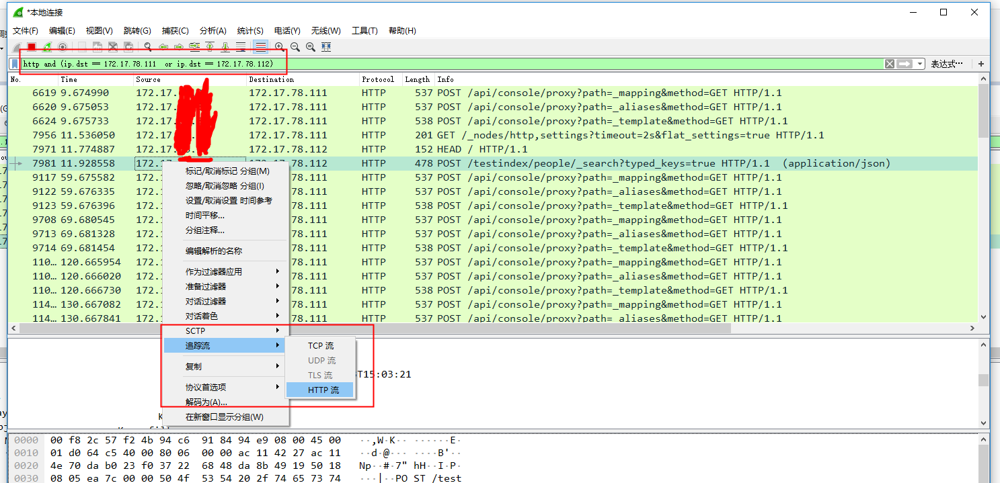

## .NetCore下ES查询驱动 PlainElastic .Net 升级官方驱动 Elasticsearch .Net

#### 1.背景
由于历史原因，笔者所在的公司原有的ES查询驱动采用的是 PlainElastic.Net, 经过询问原来是之前PlainElastic.Net在园子里文档较多，上手比较容易,所以最初作者选用了该驱动，而发布也由于历史原因都部署在 windows 服务器上，基于 .NET Framework开发。

后来由于迁移 .NET CORE 平台的需要，对代码进行了升级，同时部署平台也迁移至 CentOS7 服务器，升级过程比较顺利，由于没有使用特殊API，所以几乎没有对业务代码做更多的修改，同时测试阶段由于没有多余的机器，仍然放在了原有Windows服务器上做的测试，一切都没有问题，完美上线。

事发突然，某天接到运维部门反馈，部署查询服务的机器突然出现 TCP 连接数超高的问题，同时这台机器其他的TCP服务也无法建立新的连接，但已经建立的连接不受影响。联想到 ElasticSearch 查询服务是基于HTTP 请求的，脑子里马上联想到 .NET Core 下 HttpClient 如果每次访问都创建新实例，则会每次都建立新的TCP连接，而 Linux 对已释放端口回收的时间窗口，会导致在高并发情况下，客户端机器端口占用持续增加，同时被调用服务端连接数也会持续增加。

基于此猜测，立马去扒了一下PlainElastic.Net源代码：


源码地址：https://github.com/Yegoroff/PlainElastic.Net/blob/master/src/PlainElastic.Net/Connection/ElasticConnection.cs
果然如猜测的那样，每次都创建了新的 HttpWebRequest 实例，看了作者的最后维护时间也已经是3年前了，可能是后来官方驱动日趋完善，作者也便停止了维护。

既然如此，那么让我们看下官方最新驱动源码是否如我们想象，是基于HttpClientFactory来解决这个问题的？

源码地址：https://github.com/elastic/elasticsearch-net/blob/master/src/Elasticsearch.Net/Connection/HttpConnection.cs

上述代码看来，官方驱动并非是采用微软官方建议的 HttpClientFactory ，而是官方底层自己维护的一个线程安全的字典来管理 HttpClient 实例池，虽是自己实现，但效果一样：相同地址的请求，是链接复用的，这样就解决不断开启 TCP 连接的问题。

问题找到，立马进行驱动升级:

#### 2.驱动升级
>说明： ElasticSearch.Net官方驱动地址：https://www.elastic.co/guide/en/elasticsearch/client/net-api/6.x/index.html
>
>官方驱动分为 Low Level Client 和 NEST(Heigh Level Client),其中Low Level Client 仅仅做了最基本的封装，几乎等价于HTTP原生调用，带来了极大的灵活性的同时，也带来使用成本，而对于开发人员来说使用 NEST 提供的更加高级的API，可以更加快速的进行开发工作，也同时可以利用到 .NET 所提供的各种语法糖，比如 => 表达式。

话不多说，看示例代码：

###### 实例创建
``` csharp
public ElasticService()
{
    var uris = new Uri[] { new Uri("http://172.17.78.111:9200"), new Uri("http://172.17.78.112:9200") }; //支持多个节点
    var connectionPool = new SniffingConnectionPool(uris);
    var settings = new ConnectionSettings(connectionPool).DefaultIndex("testindex");//注意index不可以大写
    settings.BasicAuthentication("", ""); //设置账号密码，没有可以跳过
    this._client = new ElasticClient(settings);
}
```

###### 插入待测试数据
```csharp
public class People 
{
    public Guid Id { get; set; }
    public string Name { get; set; }
    public int Age { get; set; }
    public DateTime Birthday { get; set; }
    public bool Gender { get; set; }
    public string Address { get; set; }
    public DateTime CreateTime { get; set; } = DateTime.Now;
}

//批量插入
public async Task<IBulkResponse> AddPeopleAsync(People[] peoples)
{
    var descriptor = new BulkDescriptor();
    foreach (var p in peoples)
    {
        var response = await _client.IndexDocumentAsync(p);
        descriptor.Index<People>(op => op.Document(p));
    }
    return await _client.BulkAsync(descriptor);//批量插入
}
```

##### 多查询条件拼接
```csharp
public QueryContainer BuildQueryContainer(SearchCondition condition)
{
    var queryCombin = new List<Func<QueryContainerDescriptor<People>, QueryContainer>>();
    if (!string.IsNullOrEmpty(condition.Name))
        queryCombin.Add(mt => mt.Match(m => m.Field(t => t.Name).Query(condition.Name))); //字符串匹配

    if (condition.Age.HasValue)
        queryCombin.Add(mt => mt.Range(m => m.Field(t => t.Address).GreaterThanOrEquals(condition.Age))); //数值区间匹配

    if (!string.IsNullOrEmpty(condition.Address))
        queryCombin.Add(mt => mt.MatchPhrase(m => m.Field(t => t.Address).Query(condition.Address))); //短语匹配

    if (!condition.Gender.HasValue)
        queryCombin.Add(mt => mt.Term(m => m.Field(t => t.Gender).Value(condition.Gender)));//精确匹配

    return Query<People>.Bool(b => b
        .Must(queryCombin)
        .Filter(f => f
            .DateRange(dr => dr.Field(t => t.CreateTime) //时间范围匹配
                .GreaterThanOrEquals(DateMath.Anchored(condition.BeginCreateTime.ToString("yyyy-MM-ddTHH:mm:ss")))
                .LessThanOrEquals(DateMath.Anchored(condition.EndCreateTime.ToString("yyyy-MM-ddTHH:mm:ss"))))));
}
```
>提示：Match 和 MatchPhrase 的区别，例如对于"长宁区"
>1. Match 会将"长宁区"进行分词匹配，例如只要包含"区"的数据（比如静安区），也会被查询命中
>2. MatchPhrase 则可以理解为短语匹配，只有当数据库包含“长宁区”完整短语的数据，才会被查询命中
###### 增加分页查询接口
```csharp
public async Task<PagedResult<People[]>> QueryPeopleAsync(SearchCondition condition, int pageIndex, int pageSize)
{
    var query = this.BuildQueryContainer(condition);
    var response = await this._client.SearchAsync<People>(s => s
            .Index("testindex")
            .From(pageIndex * pageSize)
            .Size(pageSize)
            .Query(q => query)
            .Sort(st => st.Descending(d => d.CreateTime)));

    if (response.ApiCall.Success)
    {
        return new PagedResult<People[]>
        {
            PageIndex = pageIndex,
            PageSize = pageSize,
            Total = response.Total,
            ReturnObj = response.Hits.Select(s => s.Source).ToArray()
        };
    }

    return new PagedResult<People[]> { IsSuccess = false };
}
```

###### 编写单元测试
```csharp
[TestMethod]
public async Task QueryPeopleTest()
{
    var condition = new SearchCondition
    {
        Address="长宁区",
        BeginCreateTime = DateTime.Now.AddDays(-1),
        EndCreateTime = DateTime.Now
    };

    var result = await this._elasticService.QueryPeopleAsync(condition, 0, 3);
    Assert.IsTrue(result.IsSuccess);
}
```

###### 利用 Wireshark 抓包分析HTTP调用细节


将抓包的数据转换为HTTP流，查看请求细节：


> 提示：通过wireshark抓包是排查错误很有效的方式，有时候通过查询文档进行分析，还不如先抓包查看请求数据来得直接，同时可以将抓包数据放在Kabana所提供的 Dev Tools中验证自己的想法。

###### 利用 Kibana 提供的 Dev Tools 验证/测试 查询条件


#### 3.总结

从.NET Framework 平台转向 .Net Core 平台，其实不仅仅是开发框架的升级，或者从 Windows 转向 Linux 的迁移，而是需要我们有更多的开源思维，即：
1. 由于会使用到更多的三方组件，开发人员需要更多关注社区的变化
2. 开源代码，意味着开发人员可以并且需要更多关注源代码的底层实现

本文示例代码地址：https://github.com/xBoo/articles/tree/master/src/ElasticSearchNetDemo